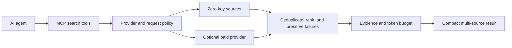

# Agent Search MCP: Free Web Search with Inspectable Evidence

**A lightweight, free-first MCP web search router with compact multi-source evidence.**

Agent Search MCP is an open-source, self-hosted MCP server and CLI. It gives AI
agents a free Tavily alternative or a local search path. The default path starts
without an API key and searches English and Chinese sources. Request policy
keeps optional paid providers explicit. Shared budgets cap provider calls,
search time, admitted results, and evidence size.

[](https://www.npmjs.com/package/agent-search-mcp)
[](https://www.npmjs.com/package/agent-search-mcp)
[](https://github.com/lennney/agent-search-mcp/stargazers)
[](https://github.com/lennney/agent-search-mcp/actions)
[](LICENSE)
[](https://glama.ai/mcp/servers/lennney/agent-search-mcp)

[中文文档](README_zh.md) · [Product page](https://take-a-deep-breath0.com/en/agent-search-mcp) · [Benchmarks](./benchmarks/) · [Architecture](./docs/architecture.md) · [CHANGELOG](./CHANGELOG.md)

---

## Install

```bash
npx -y agent-search-mcp
```

Requires Node.js >= 18.17. The default runtime does not require a browser,
database, Python, or a search API account.

### Connect an MCP client

Use this stdio configuration in MCP clients that accept `mcpServers` JSON,
including Claude Desktop, Cursor, VS Code, and Windsurf:

```json
{
  "mcpServers": {
    "agent-search": {
      "command": "npx",
      "args": ["-y", "agent-search-mcp"]
    }
  }
}
```

Claude Code and Codex can register the same `npx -y agent-search-mcp` stdio
command through their MCP settings.

### Add the optional Agent Skill

After connecting the MCP server, Agent Skills-compatible clients can install
the repository-owned routing guide:

```bash
npx skills add lennney/agent-search-mcp --skill agent-search
```

Invoke it with a request such as `Use $agent-search to verify this claim with
official sources.` The [Agent Search Skill](./skills/agent-search/SKILL.md)
chooses one of four bounded paths: quick discovery, stricter verification,
Chinese-source search, or extraction of a selected URL. It checks that the
needed MCP tool exists and asks before any install or configuration change.
Installing the Skill does not start or configure the MCP server.

### Example: inspect a bounded search result

After building the local package, run a CLI query without adding a provider key:

```bash
npm run build
fasm search "MCP server without an API key" --json
```

The response contract keeps result evidence, `meta.execution`, and
`partialFailures` separate. A provider timeout or challenge remains visible to
the agent instead of being converted into an unexplained empty result. This is
a contract example, not a live availability or search-quality benchmark.

After a global install, check the local runtime without making a search request:

```bash
npm install -g agent-search-mcp
fasm doctor
```

## Why Agent Search MCP

| Need | Product behavior |
|---|---|
| Free web search | Zero-key sources work without an API account |
| Provider cost control | Paid providers run only under an explicit routing policy |
| Token cost control | Compact output and one evidence budget bound response size |
| Multi-source evidence | Results retain provenance, relevance, provider-family count, and partial failures |
| Chinese web search | Sogou and Baidu handle Chinese queries without a translation layer |
| Lightweight self-hosting | Pure Node.js runtime with stdio, Streamable HTTP, and CLI access |

### Inspect the search evidence

Each JSON response includes one Search Evidence Packet. It answers the routing
questions an agent needs before it uses a result:

| Question | Response field |
|---|---|
| Which adapters ran? | `meta.execution.searched_engines` |
| Why did the router stop? | `meta.execution.stop_reason` and `meta.execution.quality_gate` |
| Did the request hit a work limit? | `meta.execution.budget` |
| Was evidence truncated? | `meta.evidence_budget` |
| Did an upstream provider fail? | `partialFailures` |
| Do multiple adapters represent independent sources? | `results[].source_count` counts provider families, not adapter names |

Run the one-minute offline contract demo:

```bash
npm run demo:evidence
npm run demo:evidence -- --json
```

It replays three synthetic scenarios through the production evidence scorer,
formatter, and MCP output helper: same-family adapter overlap, visible fallback
failure, and a bounded quality-gate stop. It makes no live availability or
search-quality claim and performs no network request.

The default `free_first` policy never spends a configured API credential.
`free_only` blocks paid providers. `quality_escalation` can call one configured
paid provider after free evidence misses the quality gate, while `paid_first`
tries that provider before the free fallback.

Request budgets cap adapter attempts, elapsed time, and admitted results.
The evidence budget caps query-relevant passages across the complete response.
Compact mode keeps full detail for the first results and reduces later entries
to source-preserving references.

### Measured token reduction

The checked-in bilingual fixture measures formatting with a locked tokenizer:

| Output | Average tokens per query | Savings vs normal |
|---|---:|---:|
| Normal | 2311.0 | |
| Compact | 1655.8 | 28.4% |
| Compact+ | 1607.5 | 30.4% |

This fixture verifies output formatting and evidence-packet behavior. It does
not measure live engine availability or search quality. See the
[benchmark method and limitations](./benchmarks/#reproducible-fixture-replay).

## How the search router works



The router evaluates each search batch against separate result, relevance,
confidence, and provider-family gates. It stops after the evidence passes those
gates and exposes the decision in `meta.execution`. Provider failures stay
visible in `partialFailures`, so an empty result cannot hide an upstream error.

The [competitive landscape (2026-08-07)](./docs/research/2026-08-07-competitive-landscape-and-product-gaps.md)
maps the crowded baseline and the product gaps. It records source dates and
fixed commits for facts that can change. The earlier
[source-level product comparison](./docs/research/2026-07-26-agent-search-product-architecture.md)
contains the architecture-specific evidence.

---

<!-- BEGIN GENERATED CAPABILITY MATRIX -->
## Engines

The runtime registers 16 adapters: 9 zero-key adapters and 7 optional API adapters.

| Engine | Access | Languages | Role |
|---|---|---|---|
| DuckDuckGo | Zero-key | en | General Web Search |
| Sogou Search | Zero-key | zh | Chinese Web Search |
| Bing | Zero-key | en, zh | Multilingual Web Search |
| Baidu | Zero-key | zh | Chinese Web Search |
| Wikipedia | Zero-key | en, zh, ja, de, fr, es, auto | Encyclopedic references |
| Startpage | Zero-key | en, auto | Privacy-oriented Web Search |
| Yandex | Zero-key | ru, en, auto | Russian and international Web Search |
| Mojeek | Zero-key | en, auto | Independent privacy-oriented index |
| Wiby | Zero-key | en | Independent small-Web index |
| Brave Search | `BRAVE_API_KEY` | en, zh | Optional commercial Web Search |
| Tavily Search | `TAVILY_API_KEY` | en, zh | Optional agent-oriented Search |
| Exa Search | `EXA_API_KEY` | en, zh | Optional neural Search |
| You.com Search | `YDC_API_KEY` | en, zh | Optional commercial Web Search |
| Tencent Web Search API | `TENCENT_WSA_API_KEY` | zh | Optional official Chinese Web Search |
| Bocha Web Search | `BOCHA_API_KEY` | zh, en | Optional Chinese-first AI Search |
| Serper Google Search | `SERPER_API_KEY` | en, zh, auto | Optional Google SERP Search |

## Tools

| Tool | Description | Best for |
|---|---|---|
| `free_search` | Multi-engine Web Search with bounded fallback | Quick facts and general discovery |
| `free_search_advanced` | Filtered waterfall search and optional enrichment | Domain policy and progressive verification |
| `free_extract` | Extract a URL as clean Markdown | Reading complete source pages |
| `fetch_github_readme` | Fetch a public GitHub repository README | Project documentation |
| `fetch_csdn_article` | Fetch a CSDN article | Chinese technical articles |
| `fetch_juejin_article` | Fetch a Juejin article | Chinese developer articles |
| `search_with_synthesis` | Search evidence with an LLM synthesis hint | Agent-authored answers from cited evidence |

### Capability controls

| Environment | Default | Purpose |
|---|---|---|
| `ENABLED_TOOLS / DISABLED_TOOLS` | all / none | Tool registration allowlist and denylist; deny wins |
| `ALLOWED_ENGINES / DENIED_ENGINES` | all / none | Engine execution allowlist and denylist; deny wins |
| `SEARCH_PROVIDER_MODE` | free_first | Default routing: free_first, quality_escalation, paid_first, or free_only |
| `PAID_ENGINE_ORDER` | brave,exa,tavily,youcom,tencent_wsa,bocha,serper | Selects the first configured optional provider; not a quality claim |
| `SEARCH_BUDGET_MAX_CALLS` | 16 | Adapter-attempt budget |
| `SEARCH_BUDGET_MAX_ELAPSED_MS` | 30000 | End-to-end elapsed-time budget |
| `SEARCH_BUDGET_MAX_RESULTS` | 100 | Admitted raw-result budget |
| `EVIDENCE_BUDGET_CHARS` | 1200 | Evidence-character budget |
<!-- END GENERATED CAPABILITY MATRIX -->

`search_with_synthesis` uses the same canonical `structuredContent` evidence
packet as the primary search tools and adds `prompt_hint`; its text content is
only a compact compatibility view. Execution metadata distinguishes scheduled
adapters from retry-inclusive adapter attempts. `http_requests` is `null` until
all adapter transports can report it without false precision.

Wiby is a genuine zero-key source backed by its official JSON API and is used
late in the free waterfall as an independent small-Web supplement. Optional
providers require user credentials; any signup credit or trial quota is
provider-controlled and is not treated as permanent free access.

All tools are read-only and idempotent. Search cancellation reaches rate-limit
waits, retries, provider requests, and optional enrichment. Enrichment can
improve a snippet but cannot increase source confidence or independent source
count.

`free_search_advanced.time_range` remains in the compatibility schema. The
server returns `UNSUPPORTED_FILTER` before searching because the general web
providers do not share one enforceable recency contract.

---

## Configuration

The generated capability table above lists the default request budgets. These
settings cover the common deployment choices:

| Goal | Environment variables |
|---|---|
| Add an optional provider | `BRAVE_API_KEY`, `TAVILY_API_KEY`, `EXA_API_KEY`, `YDC_API_KEY`, `TENCENT_WSA_API_KEY`, `BOCHA_API_KEY`, or `SERPER_API_KEY` |
| Choose spend policy | `SEARCH_PROVIDER_MODE`, `PAID_ENGINE_ORDER` |
| Reduce response tokens | `OUTPUT_STYLE=compact`, `MAX_FULL_RESULTS`, `SNIPPET_LENGTH`, `EVIDENCE_BUDGET_CHARS` |
| Restrict tools or engines | `ENABLED_TOOLS`, `DISABLED_TOOLS`, `ALLOWED_ENGINES`, `DENIED_ENGINES` |
| Use an explicit proxy | `DUCKDUCKGO_PROXY_URL`, `SOGOU_PROXY_URL`, or `USE_PROXY=true` with `PROXY_URL` |
| Use a user-owned proxy pool | `DUCKDUCKGO_PROXY_URLS` or `SOGOU_PROXY_URLS` as a JSON array of 2-16 HTTP(S) proxy URLs |
| Persist the exact-result cache | `SEARCH_CACHE_DIRECTORY`, `SEARCH_CACHE_TTL_MS`, `SEARCH_CACHE_MAX_ENTRIES` |
| Enable optional semantic processing | `SEMANTIC_DEDUP`, `SEMANTIC_RERANK`, `DEDUP_THRESHOLD`, `RERANK_TOP_K` |

Adding an API key does not authorize paid traffic. The routing policy controls
provider use. The default exact-result cache stays in memory; setting
`SEARCH_CACHE_DIRECTORY` opts into local persistence. Semantic processing is
the only optional feature that uses Python and Model2Vec.

Proxy pools select a deterministic first exit from the logical query and keep
multi-step provider requests sticky. Only a transport failure can move to the
next configured exit; a failed transport is cooled for 60 seconds. HTTP
responses, including 403, 429, and challenge pages, never trigger proxy
switching and continue through the provider's existing cooldown contract.
Engine-specific single-proxy variables take precedence over their pool. Proxy
credentials are never printed by `fasm doctor`.

### HTTP deployment

HTTP mode requires `HTTP_AUTH_TOKEN` unless you set
`HTTP_ALLOW_UNAUTHENTICATED=true`. Browser requests with an `Origin` header must
match `ALLOWED_ORIGINS`. See the [HTTP deployment guide](./docs/http-deployment.md)
for TLS termination, token rotation, and reverse-proxy examples.

---

## CLI

The package includes the `fasm` CLI:

```bash
fasm search "TypeScript MCP server"
fasm search "query" --count 5 --engines bing,baidu,youcom --json
fasm extract "https://example.com"
fasm extract "https://example.com" --json
fasm doctor
fasm doctor --json
HTTP_AUTH_TOKEN=change-me MODE=http npx agent-search-mcp
```

`fasm doctor` reads local configuration without network probes and never prints
credential or proxy values.

---

## Documentation and evidence

| Document | Contents |
|---|---|
| [System architecture](./docs/architecture.md) | Routing, evidence, provider families, and configuration |
| [Competitive landscape](./docs/research/2026-08-07-competitive-landscape-and-product-gaps.md) | Current competitors, baseline expectations, and product gaps |
| [Product comparison](./docs/research/2026-07-26-agent-search-product-architecture.md) | Source-level review of Agent search products |
| [Benchmarks](./benchmarks/) | Token fixture, live-run scope, and quality evaluation method |
| [v3.2.0 release notes](./docs/releases/v3.2.0.md) | Provider policy, budgets, and migration notes |
| [Earlier release candidate evidence](./docs/evidence/2026-07-26-release-candidate-smoke.md) | Pre-expansion packed-install matrix and limitations |
| [MCP 2026 readiness](./docs/plans/2026-07-25-mcp-ecosystem-and-2026-readiness.md) | Isolated protocol experiment and remaining gates |

## Companion: Slim Guard

Agent Search controls retrieval work and compresses search evidence.
[mcp-slim-guard](https://github.com/lennney/mcp-slim-guard) sits between an
agent and MCP servers to handle tool-schema compression and security policy.

```bash
npm install -g mcp-slim-guard
```

---

## Development

```bash
git clone https://github.com/lennney/agent-search-mcp.git
cd agent-search-mcp
npm install
npm run build
npm test
npm run dev        # stdio mode
npm run dev:http   # HTTP mode (port 3000)
```

The stable package supports Node.js 18, 20, and 22. The isolated MCP 2026
experiment requires Node.js 20 or newer.

---

## License

[Apache 2.0](LICENSE)

Based on [open-websearch](https://github.com/Aas-ee/open-websearch) by Aas-ee.

If Agent Search MCP helps your agent, [star the repository](https://github.com/lennney/agent-search-mcp)
so other developers can find the project.
