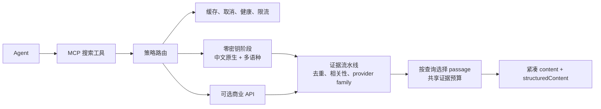

# Agent Search MCP

> **给 AI Agent 的免费、省 Token 网页搜索。**
> 8 个零密钥来源直接起步；用瀑布停止和紧凑输出减少上下文；中文查询原生路由，只在需要时升级商业 API。`npx agent-search-mcp` 即可使用。

[](https://www.npmjs.com/package/agent-search-mcp)
[](https://www.npmjs.com/package/agent-search-mcp)
[](https://github.com/lennney/agent-search-mcp/stargazers)
[](https://github.com/lennney/agent-search-mcp/actions)
[](LICENSE)
[](https://glama.ai/mcp/servers/lennney/agent-search-mcp)

[English](README.md) · [Benchmarks](./benchmarks/) · [CHANGELOG](./CHANGELOG.md)

如果 Agent Search MCP 已经进入你的工具栈，欢迎[给仓库一个 Star](https://github.com/lennney/agent-search-mcp)，让更多 Agent 找到真正零密钥的搜索路径。

---

## 为什么选择 Agent Search MCP

用户第一眼能感受到的价值很直接：**不买搜索 API 也能搜，不盲目丢证据也能少花 token**。支撑这两个卖点的机制，是一套决定**去哪里搜、什么时候停、花多少上下文、哪些证据值得信**的搜索策略。Agent Search MCP 做的就是这个控制层。

这条路线是：**零密钥起步 → 中文原生路由 → 多源证据可检查 → 按 token 预算渐进搜索 → 必要时升级商业 API**。12 个适配器是这条路线的实现，适配器数量本身不是产品故事。

| | Agent Search MCP | [MCP Web Hound](https://github.com/ilgizar-valiullin/mcp-web-hound/tree/f468da9943952fddc1ed71ca977b18b60f40ca11) | [Tavily](https://github.com/tavily-ai/tavily-mcp) | [Exa](https://github.com/exa-labs/exa-mcp-server) | [Brave](https://github.com/brave/brave-search-mcp-server) |
|---|:---:|:---:|:---:|:---:|:---:|
| **无需用户 API Key 起步** | **是——自行运行适配器** | 是——4 个抓取适配器 | 受限——keyless Search/Extract | 受限——托管免费 MCP | 否 |
| **零密钥调用路径** | **本地策略路由** | 本地抓取路由 | Tavily 服务 | Exa 托管服务 | — |
| **搜索后端** | **8 个零密钥 + 4 个可选 API** | 4 个零密钥 + 4 个可选 API | Tavily API | Exa 索引 | Brave 索引 |
| **跨引擎聚合** | **按 provider family 建模** | URL 合并；默认 2 个并行槽位 | 单一上游 | 单一上游 | 单一上游 |
| **专用中文引擎** | **搜狗 + 百度** | 无 | 无 | 无 | 无 |
| **持久语义查询缓存** | 无——短期精确缓存；可选结果重排 | 有——SQLite + sqlite-vec | 服务端管理 | 服务端管理 | 服务端管理 |
| **搜索失败证据** | **逐引擎 `partialFailures`** | 仅全部 provider 失败时返回工具错误 | 单上游错误 | 单上游错误 | 单上游错误 |
| **本地传输** | **stdio + Streamable HTTP** | stdio | stdio | stdio | stdio |
| **最适合** | 零密钥、多语种、上下文有预算的证据检索 | 本地语义缓存与简洁诊断 | 托管搜索/提取/Map/Crawl | 语义、代码、企业研究 | 独立索引 + 垂直搜索 |

对比信息于 2026-07-26 按官方仓库与固定源码快照核对。MCP Web Hound 的持久语义缓存、NLI 重排以及简洁的状态/配置体验是真实差异；它的 GitHub/GitLab 工具是独立直连 API，并不共享网页搜索流水线。Tavily 当前本地 MCP 提供受限的 keyless Search/Extract；Exa 托管 MCP 有受限的免费零密钥入口，但本地 npm Server 使用 `EXA_API_KEY`。价格、限额、Star 和下载量变化快，因此表格只比较实现边界。完整源码解剖见[产品架构调查](./docs/research/2026-07-26-agent-search-product-architecture.md#mcp-web-hound)。

### 搜索策略如何工作



路由会渐进地花费 provider 调用和上下文。只有可观察的证据门达标才停止，
同时保留失败、来源和预算元数据。完整模块图见[系统架构](./docs/architecture.md)。

### 默认零密钥

8 个适配器无需凭证：DuckDuckGo、搜狗、Bing、百度、Wikipedia、Startpage、Yandex、Mojeek。需要商业 API 时，可选启用 Brave、Tavily、Exa 和 You.com。

DuckDuckGo 会先使用搜索页签发的 Web preload，再退到旧的 HTML/Lite 表示。
上游 CAPTCHA/反爬响应会以 `bot_challenge` 返回，并让该 provider 进入有界冷却；
不会再误报成缺少 API Key，也不会在同一出口持续重试。

### 渐进式多源搜索

内置并行/瀑布编排、URL/标题去重、排序与自动降级。只有结果数量、逐条相关性、平均来源置信度和独立 provider family 分别达标，才跳过后续批次；`meta.execution` 会返回观测到的质量门和 `stop_reason`。两种路由复用同一个证据评估模块；域名过滤会在去重前按精确主机名或真实子域执行，避免相似域名误命中。启用语义去重或重排后，每个路由检查点都会用变换后的展示结果决定是否跳过后续工作，并通过 `quality_gate_stage` 公开判断阶段。Compact 模式支持渐进披露，让 Agent 先看高优先级结果，只在需要时调用 `free_extract` 深挖正文。

### 可检查的证据包

完整结果把 provenance、relevance、独立 provider-family 数、上游发布时间和提取元数据分开保存。响应级字符预算限制 passage 内容；Compact 占位结果仍保留来源列表，引擎失败仍通过 `partialFailures` 可见。
`free_search` 与 `free_search_advanced` 通过 MCP `structuredContent` 和同一个 `outputSchema` 发布这一证据包；文本通道只是同一份数据的紧凑视图，不再维护第二套 JSON 合同。

### Token 控制是产品能力

通过 `OUTPUT_STYLE=compact`、`MAX_FULL_RESULTS`、`SNIPPET_LENGTH`、`EVIDENCE_BUDGET_CHARS`、`MIN_CONFIDENCE` 和 `MIN_SOURCE_COUNT`，使用者可在上下文体积和信息细节间主动取舍。历史 30 查询真实运行实测了 **Compact 节省 28.7% token**、**Compact+ 节省 35.5%**，以及相比 8 引擎全并发 **少 75% 引擎调用**。这是特定查询集和环境的实测，不是通用保证。新的冻结 fixture 回放包含证据元数据，当前可重现 28.4% / 30.4% 的格式化节省。

### 原生中文搜索

搜狗 + 百度直接搜索中文互联网 — 微信公众号内容、百度百科、中文技术论坛。不是翻译层，不是附属功能。

---

## 快速开始

```bash
# 一条命令 — 无需安装，无需 API Key
npx agent-search-mcp
```

需要 Node.js >= 18.17。

### 客户端配置

<details>
<summary><b>Claude Code / Claude Desktop</b></summary>

```json
{
  "mcpServers": {
    "agent-search": {
      "command": "npx",
      "args": ["-y", "agent-search-mcp"]
    }
  }
}
```
</details>

<details>
<summary><b>Cursor / VS Code / Codex</b></summary>

```json
{
  "mcpServers": {
    "agent-search": {
      "command": "npx",
      "args": ["-y", "agent-search-mcp"]
    }
  }
}
```
</details>

<details>
<summary><b>Windsurf</b></summary>

```json
{
  "mcpServers": {
    "agent-search": {
      "command": "npx",
      "args": ["-y", "agent-search-mcp"]
    }
  }
}
```
</details>

<details>
<summary><b>Hermes</b></summary>

```yaml
mcp_servers:
  agent-search:
    command: npx
    args: ["-y", "agent-search-mcp"]
```
</details>

---

## 搜索引擎

包内包含 12 个引擎适配器，现在均可从 `free_search`、`free_search_advanced`、CLI 和瀑布路由选择。8 个零密钥引擎直接可用；Brave、Tavily、Exa 和 You.com 在配置 API Key 后启用。

| 引擎 | 免费 | 优势 |
|------|:----:|------|
| **DuckDuckGo** | ✅ | 隐私保护，英文搜索 |
| **搜狗** | ✅ | 中文网页搜索，微信公众号内容 |
| **Bing** | ✅ | 多语言，英文结果好 |
| **百度** | ✅ | 中文网页搜索，百度百科 |
| **Wikipedia** | ✅ | 结构化知识，JSON API |
| **Startpage** | ✅ | Google 结果通过隐私代理 |
| **Yandex** | ✅ | 俄语/西里尔语搜索 |
| **Mojeek** | ✅ | 独立爬虫，隐私优先 |
| Brave Search | ❌ | 高质量网页搜索（本项目适配器需要用户 API Key） |
| Tavily | ❌ | Agent 优化的可选适配器（本项目需要用户 API Key） |
| Exa | ❌ | 神经语义的可选适配器（本项目需要用户 API Key） |
| You.com | ❌ | AI 搜索的可选适配器（本项目需要用户 API Key） |

---

## 工具

| 工具 | 说明 | 适用场景 |
|------|------|----------|
| `free_search` | 多引擎搜索 + 自动回退 | 快速查事实 |
| `free_search_advanced` | 过滤搜索 + 瀑布流程 + 内容丰富化 | 高置信度、域名过滤或中文查询 |
| `free_search_news` | DDG 新闻 + Bing 新闻 | 时事新闻 |
| `search_with_synthesis` | 深度搜索 + LLM 综合提示 | 复杂查询需多源验证 |
| `free_extract` | 提取完整页面为 Markdown | 阅读搜索结果中的页面 |
| `fetch_github_readme` | 获取 GitHub 仓库 README | 项目文档查阅 |
| `fetch_csdn_article` | 获取 CSDN 文章内容 | 中文开发者文章 |
| `fetch_juejin_article` | 获取掘金文章内容 | 中文开发者文章 |

所有工具均为只读、幂等，带 MCP 2025 注解。
`free_search_advanced.time_range` 仍保留在兼容 schema 中，但已弃用：传入后会在
调用任何引擎前返回 `UNSUPPORTED_FILTER`，因为通用搜索适配器没有统一且可验证的
时间过滤合同。

运行状态不需要再占一个默认工具槽位：`search://health` 返回 provider/熔断状态，
`mcp://health/metrics` 返回延迟与缓存指标，`search://capabilities` 描述当前能力面。
HTTP 部署另提供仅供探针使用的匿名 `GET /health`；它不会返回 API Key 或搜索结果。

---

## 配置

### 环境变量

| 变量 | 默认值 | 说明 |
|------|--------|------|
| `BRAVE_API_KEY` | — | Brave Search API Key |
| `TAVILY_API_KEY` | — | Tavily API Key |
| `EXA_API_KEY` | — | Exa API Key |
| `YDC_API_KEY` | — | You.com API Key |
| `LOG_LEVEL` | `info` | 日志级别：`info` 或 `debug` |
| `MODE` | `stdio` | 传输方式：`stdio`、`http` 或 `both` |
| `PORT` | `3000` | HTTP 服务端口（`MODE=http` 或 `both` 时） |
| `OUTPUT_STYLE` | `normal` | `compact` 开启 token 优化输出 |
| `SNIPPET_LENGTH` | `200` | 摘要最大字符数（60–500） |
| `MAX_FULL_RESULTS` | `3` | compact 模式下的完整结果数 |
| `EVIDENCE_BUDGET_CHARS` | `1200` | 每次响应共享的证据段落字符预算（200–20000） |
| `MIN_CONFIDENCE` | `0` | 置信度阈值（0.0–1.0）；历史值 2–3 自动映射为来源数 |
| `MIN_SOURCE_COUNT` | `1` | 最少独立上游 provider family 数；兼容接受 1–12，当前适配器集合最多 11 |
| `HTTP_AUTH_TOKEN` | — | HTTP 模式必需的 Bearer Token |
| `HTTP_ALLOW_UNAUTHENTICATED` | `false` | 显式关闭 HTTP 认证（仅限受信任本地网络） |
| `ALLOWED_ORIGINS` | — | 允许访问 HTTP 端点的浏览器 Origin，逗号分隔 |
| `USE_PROXY` | `false` | 让 DuckDuckGo 和 Sogou 使用项目显式代理 |
| `PROXY_URL` | `http://127.0.0.1:7890` | `USE_PROXY=true` 时使用的共享 HTTP(S) 代理 |
| `DUCKDUCKGO_PROXY_URL` | — | 仅覆盖 DuckDuckGo，并直接启用该引擎代理 |
| `SOGOU_PROXY_URL` | — | 仅覆盖 Sogou，并直接启用该引擎代理 |
| `SEMANTIC_DEDUP` | `false` | 语义去重（需 `pip install model2vec`） |
| `DEDUP_THRESHOLD` | `0.85` | 语义去重的余弦相似度阈值 |
| `SEMANTIC_RERANK` | `false` | 语义重排（需 `pip install model2vec`） |
| `RERANK_TOP_K` | `5` | 语义重排保留的结果数 |

**零配置即可使用** — 8 个免费引擎无需任何 API Key。

DuckDuckGo 现为纯 Node.js 实现（Web preload → HTML → Lite），不再探测或
调用 Python/ddgs。代理 URL 可包含标准 URL 凭证，但凭证不会进入 dispatcher
错误。项目有意忽略系统 `HTTP_PROXY` / `HTTPS_PROXY`，避免 MCP 服务流量被
隐式改道。CLI 可用
`fasm search "query" --proxy http://127.0.0.1:7890` 为 DDG 和 Sogou
设置显式代理。

### 工具可见性

```bash
# 只启用指定工具
ENABLED_TOOLS=free_search,free_search_advanced,free_search_news

# 禁用指定工具
DISABLED_TOOLS=free_extract,fetch_github_readme
```

`DISABLED_TOOLS` 优先级高于 `ENABLED_TOOLS`。

### HTTP 部署

HTTP 模式采用安全默认值：`/mcp` 要求 `Authorization: Bearer <token>`，带 `Origin` 请求头的浏览器请求必须命中 `ALLOWED_ORIGINS`。`/health` 保留给健康检查；生产环境应在受信反向代理终止 TLS，并把 Token 当作密钥轮换。详见 [HTTP 部署指南](./docs/http-deployment.md)。

### 引擎过滤

```bash
ALLOWED_ENGINES=sogou,baidu    # 只用中文引擎
DENIED_ENGINES=yandex,mojeek   # 排除特定引擎
```

---

## CLI

`agent-search-mcp` 附带独立的命令行工具（`fasm`）。
发布包入口会解析 npm 的平台 shim/symlink，包括 Windows 的 `fasm.cmd`。

```bash
# 搜索
fasm search "TypeScript MCP server"
fasm search "关键词" --count 5 --engines bing,baidu,youcom --json

# 提取网页
fasm extract "https://example.com"
fasm extract "https://example.com" --json

# 只读检查本地搜索配置，不发网络探测、不写配置
fasm doctor
fasm doctor --json

# HTTP MCP 服务（默认要求 Bearer 认证）
HTTP_AUTH_TOKEN=change-me MODE=http npx agent-search-mcp
```

`doctor-report-v1` 使用 `present` / `missing` / `invalid` 表示本地配置就绪度，
并给出相关环境变量名等来源；它不会输出凭证或代理值。

---

## 基准测试

基准现在分三条证据线。2026-07-24 历史真实运行覆盖 30 条中英文查询，实测 Compact 28.7%、Compact+ 35.5%，以及相比 8 引擎全并发少 75% 调用；由于当时没有保存原始响应 fixture，它们仍是限定查询集和环境的历史实测。冻结格式回放用锁定的 `gpt-tokenizer` 校验当前 28.4% / 30.4% 的证据包格式化节省。新的评审门禁流水线保存原始响应哈希和引擎结果，分别报告检索、引用支持、延迟与失败透明度；在没有合成答案时，答案正确率和每个正确答案 Token 数明确标为未测量。Bootstrap 标签不能用于公开质量声明，仓库内真实 pilot 也尚未完成 AI 评审。这些口径都不是跨产品质量排名或生产保证。

→ [方法、查询、限制与报告](./benchmarks/)

---

## 配套工具

**🛡️ [mcp-slim-guard](https://github.com/lennney/mcp-slim-guard)** — 为你的 MCP 栈添加安全 + 压缩

```bash
npm install -g mcp-slim-guard
mcp-slim-guard init
mcp-slim-guard start
```

```
AI Agent → mcp-slim-guard (安全 + 压缩) → agent-search-mcp
```

| 功能 | 效果 |
|------|------|
| **Schema 压缩** | 回收约 83% 上下文窗口 — 1,736 → 300 tokens |
| **工具白名单** | Glob 模式控制哪些工具可调用 |
| **SSRF 保护** | IP 黑名单 + 域名白名单，拦截内网请求 |
| **注入检测** | 17 种启发式模式，防提示注入/SQL/Shell |
| **速率限制** | 每工具 Token Bucket，默认 60 req/min |
| **审计日志** | 结构化 JSON 日志，支持轮转 + gzip |

---

## 开发

```bash
git clone https://github.com/lennney/agent-search-mcp.git
cd agent-search-mcp
npm install
npm run build
npm test
npm run dev        # stdio 模式
npm run dev:http   # HTTP 模式（端口 3000）
```

构建脚本支持跨平台；CI 在 Linux 上覆盖 Node.js 18/20/22，并执行 Windows 构建冒烟测试。

---

## 许可证

[Apache 2.0](LICENSE)

基于 [open-websearch](https://github.com/Aas-ee/open-websearch) by Aas-ee。
