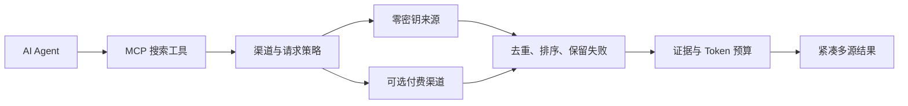

# Agent Search MCP：给 AI Agent 的免费网页搜索

**轻量、免费优先的 MCP 网页搜索路由器，返回紧凑的多源证据。**

Agent Search MCP 是开源、自托管的 MCP Server 和 CLI。无需 API Key
即可启动，直接搜索中英文来源；付费渠道受显式策略控制；每次请求都可以限制
渠道调用、搜索时间、结果数量和证据体积。

[](https://www.npmjs.com/package/agent-search-mcp)
[](https://www.npmjs.com/package/agent-search-mcp)
[](https://github.com/lennney/agent-search-mcp/stargazers)
[](https://github.com/lennney/agent-search-mcp/actions)
[](LICENSE)
[](https://glama.ai/mcp/servers/lennney/agent-search-mcp)

[English](README.md) · [Benchmarks](./benchmarks/) · [架构](./docs/architecture.md) · [CHANGELOG](./CHANGELOG.md)

---

## 安装

```bash
npx -y agent-search-mcp
```

需要 Node.js >= 18.17。默认运行时不要求浏览器、数据库、Python 或搜索 API
账号。

### 连接 MCP 客户端

Claude Desktop、Cursor、VS Code 和 Windsurf 等接受 `mcpServers` JSON 的
客户端可以使用同一份 stdio 配置：

```json
{
  "mcpServers": {
    "agent-search": {
      "command": "npx",
      "args": ["-y", "agent-search-mcp"]
    }
  }
}
```

Claude Code 和 Codex 也可以在各自的 MCP 设置中注册同一条
`npx -y agent-search-mcp` stdio 命令。

全局安装后，可以在不发起搜索请求的情况下检查本地配置：

```bash
npm install -g agent-search-mcp
fasm doctor
```

## 为什么选择 Agent Search MCP

| 需求 | 产品行为 |
|---|---|
| 免费网页搜索 | 8 个来源无需 API Key 或账号 |
| 渠道成本控制 | 只有显式路由策略才能调用付费渠道 |
| Token 成本控制 | 紧凑输出和共享证据预算限制响应体积 |
| 多源证据 | 结果保留来源、相关性、provider-family 数量和部分失败 |
| 中文网页搜索 | 搜狗和百度直接处理中文查询，无需翻译层 |
| 轻量自托管 | 纯 Node.js 运行时，支持 stdio、Streamable HTTP 和 CLI |

默认 `free_first` 策略不会消耗已经配置的 API 凭证。`free_only` 禁止付费渠道；
`quality_escalation` 在免费证据未通过质量门时调用一个已配置付费渠道；
`paid_first` 先尝试该渠道，再回退到免费来源。

请求预算限制适配器尝试次数、总耗时和接纳结果数。证据预算限制整个响应内
与查询相关的段落。Compact 模式保留前几条结果的完整内容，后续结果缩减为
仍带来源信息的引用。

### 可复现的 Token 节省

仓库内的双语冻结 fixture 使用锁定的 tokenizer 测量格式化结果：

| 输出 | 每次查询平均 Token | 相比 Normal |
|---|---:|---:|
| Normal | 2311.0 | |
| Compact | 1655.8 | 节省 28.4% |
| Compact+ | 1607.5 | 节省 30.4% |

这组 fixture 只验证输出格式和证据包行为，不代表真实引擎可用率或搜索质量。
具体方法与限制见[基准说明](./benchmarks/#reproducible-fixture-replay)。

## 搜索路由如何工作



路由器分别检查结果数、相关性、置信度和 provider-family 覆盖。证据通过这些门槛后，
路由停止后续批次，并在 `meta.execution` 中公开决策。Provider 失败保留在
`partialFailures` 中，空结果不会掩盖上游异常。

[源码级产品对比](./docs/research/2026-07-26-agent-search-product-architecture.md)
说明 Agent Search MCP 与 Tavily、Exa、Brave Search、Firecrawl 和 MCP Web Hound
在路由、证据、本地运行、付费渠道边界和中文搜索方面的差异。文档不使用容易过期的
价格和热度数字。

---

<!-- BEGIN GENERATED CAPABILITY MATRIX -->
## 搜索引擎

运行时注册了 16 个适配器：9 个零密钥适配器和 7 个可选 API 适配器。

| 引擎 | 访问方式 | 语言 | 定位 |
|---|---|---|---|
| DuckDuckGo | 零密钥 | en | 通用网页搜索 |
| Sogou Search | 零密钥 | zh | 中文网页搜索 |
| Bing | 零密钥 | en, zh | 多语言网页搜索 |
| Baidu | 零密钥 | zh | 中文网页搜索 |
| Wikipedia | 零密钥 | en, zh, ja, de, fr, es, auto | 百科参考资料 |
| Startpage | 零密钥 | en, auto | 隐私导向网页搜索 |
| Yandex | 零密钥 | ru, en, auto | 俄语及国际网页搜索 |
| Mojeek | 零密钥 | en, auto | 独立隐私导向索引 |
| Wiby | 零密钥 | en | 独立小型网页索引 |
| Brave Search | `BRAVE_API_KEY` | en, zh | 可选商业网页搜索 |
| Tavily Search | `TAVILY_API_KEY` | en, zh | 可选 Agent 导向搜索 |
| Exa Search | `EXA_API_KEY` | en, zh | 可选神经语义搜索 |
| You.com Search | `YDC_API_KEY` | en, zh | 可选商业网页搜索 |
| Tencent Web Search API | `TENCENT_WSA_API_KEY` | zh | 可选官方中文联网搜索 |
| Bocha Web Search | `BOCHA_API_KEY` | zh, en | 可选中文优先 AI 搜索 |
| Serper Google Search | `SERPER_API_KEY` | en, zh, auto | 可选 Google SERP 搜索 |

## 工具

| 工具 | 说明 | 适用场景 |
|---|---|---|
| `free_search` | 多引擎网页搜索与有界回退 | 快速查事实和通用发现 |
| `free_search_advanced` | 过滤、瀑布搜索和可选内容丰富化 | 域名策略和渐进验证 |
| `free_extract` | 将网页提取为干净 Markdown | 读取完整来源页面 |
| `fetch_github_readme` | 获取公开 GitHub 仓库 README | 项目文档查阅 |
| `fetch_csdn_article` | 获取 CSDN 文章 | 中文技术文章 |
| `fetch_juejin_article` | 获取掘金文章 | 中文开发者文章 |
| `search_with_synthesis` | 搜索证据和 LLM 综合提示 | 基于引用证据生成回答 |
| `free_search_news` | 近期新闻搜索 | 时效性信息发现 |

### 能力控制

| 环境变量 | 默认值 | 作用 |
|---|---|---|
| `ENABLED_TOOLS / DISABLED_TOOLS` | all / none | 工具注册允许列表和拒绝列表；拒绝优先 |
| `ALLOWED_ENGINES / DENIED_ENGINES` | all / none | 引擎执行允许列表和拒绝列表；拒绝优先 |
| `SEARCH_PROVIDER_MODE` | free_first | 默认路由：free_first、quality_escalation、paid_first 或 free_only |
| `PAID_ENGINE_ORDER` | brave,exa,tavily,youcom,tencent_wsa,bocha,serper | 选择首个已配置可选渠道，不代表质量排名 |
| `SEARCH_BUDGET_MAX_CALLS` | 16 | 适配器尝试次数预算 |
| `SEARCH_BUDGET_MAX_ELAPSED_MS` | 30000 | 端到端耗时预算 |
| `SEARCH_BUDGET_MAX_RESULTS` | 100 | 接纳原始结果数量预算 |
| `EVIDENCE_BUDGET_CHARS` | 1200 | 证据字符预算 |
<!-- END GENERATED CAPABILITY MATRIX -->

Wiby 使用官方 JSON API，是无需账号和 API Key 的真实零密钥来源，只在免费瀑布
后段补充独立小型网页。可选 Provider 需要用户自带凭证；注册送额度或试用配额由
上游控制，本项目不把它们宣传成永久免费的渠道。

所有工具均为只读、幂等。取消信号会传递到限流等待、重试、Provider 请求和可选
内容丰富化。内容丰富化只能改善摘要，不能提高来源置信度或独立来源数。

`free_search_advanced.time_range` 仍保留在兼容 schema 中。通用网页 Provider
没有统一且可验证的时间过滤合同，因此服务会在搜索前返回
`UNSUPPORTED_FILTER`。

---

## 配置

上面的能力表列出了默认请求预算。常用部署选项如下：

| 目标 | 环境变量 |
|---|---|
| 增加可选渠道 | `BRAVE_API_KEY`、`TAVILY_API_KEY`、`EXA_API_KEY`、`YDC_API_KEY`、`TENCENT_WSA_API_KEY`、`BOCHA_API_KEY` 或 `SERPER_API_KEY` |
| 选择费用策略 | `SEARCH_PROVIDER_MODE`、`PAID_ENGINE_ORDER` |
| 减少响应 Token | `OUTPUT_STYLE=compact`、`MAX_FULL_RESULTS`、`SNIPPET_LENGTH`、`EVIDENCE_BUDGET_CHARS` |
| 限制工具或引擎 | `ENABLED_TOOLS`、`DISABLED_TOOLS`、`ALLOWED_ENGINES`、`DENIED_ENGINES` |
| 使用显式代理 | `DUCKDUCKGO_PROXY_URL`、`SOGOU_PROXY_URL`，或 `USE_PROXY=true` 配合 `PROXY_URL` |
| 持久化精确结果缓存 | `SEARCH_CACHE_DIRECTORY`、`SEARCH_CACHE_TTL_MS`、`SEARCH_CACHE_MAX_ENTRIES` |
| 开启可选语义处理 | `SEMANTIC_DEDUP`、`SEMANTIC_RERANK`、`DEDUP_THRESHOLD`、`RERANK_TOP_K` |

添加 API Key 不会授权付费流量，路由策略决定是否调用。默认精确结果缓存只存在
内存中，设置 `SEARCH_CACHE_DIRECTORY` 后才会写入本地。语义处理是唯一使用
Python 和 Model2Vec 的可选功能。

### HTTP 部署

HTTP 模式要求 `HTTP_AUTH_TOKEN`，除非显式设置
`HTTP_ALLOW_UNAUTHENTICATED=true`。带 `Origin` 请求头的浏览器请求必须命中
`ALLOWED_ORIGINS`。TLS 终止、Token 轮换和反向代理示例见
[HTTP 部署指南](./docs/http-deployment.md)。

---

## CLI

发布包附带 `fasm` CLI：

```bash
fasm search "TypeScript MCP server"
fasm search "关键词" --count 5 --engines bing,baidu,youcom --json
fasm extract "https://example.com"
fasm extract "https://example.com" --json
fasm doctor
fasm doctor --json
HTTP_AUTH_TOKEN=change-me MODE=http npx agent-search-mcp
```

`fasm doctor` 只读取本地配置，不发网络探测，也不会输出凭证或代理值。

---

## 文档与证据

| 文档 | 内容 |
|---|---|
| [系统架构](./docs/architecture.md) | 路由、证据、provider family 和配置 |
| [产品对比](./docs/research/2026-07-26-agent-search-product-architecture.md) | Agent 搜索产品的源码级调查 |
| [基准测试](./benchmarks/) | Token fixture、真实运行边界和质量评测方法 |
| [v3.2.0 发布说明](./docs/releases/v3.2.0.md) | 渠道策略、预算和迁移说明 |
| [发布候选证据](./docs/evidence/2026-07-26-release-candidate-smoke.md) | 打包安装和 Node 18/20/22 冒烟结果 |
| [MCP 2026 适配](./docs/plans/2026-07-25-mcp-ecosystem-and-2026-readiness.md) | 隔离实验和剩余门禁 |

## 配套产品：Slim Guard

Agent Search 控制检索工作并压缩搜索证据。
[mcp-slim-guard](https://github.com/lennney/mcp-slim-guard) 位于 Agent 与
MCP Server 之间，负责工具 Schema 压缩和安全策略。

```bash
npm install -g mcp-slim-guard
```

---

## 开发

```bash
git clone https://github.com/lennney/agent-search-mcp.git
cd agent-search-mcp
npm install
npm run build
npm test
npm run dev        # stdio 模式
npm run dev:http   # HTTP 模式（端口 3000）
```

稳定包支持 Node.js 18、20 和 22。隔离的 MCP 2026 实验需要 Node.js 20 或更高版本。

---

## 许可证

[Apache 2.0](LICENSE)

基于 [open-websearch](https://github.com/Aas-ee/open-websearch) by Aas-ee。

如果 Agent Search MCP 对你的 Agent 有帮助，可以[给仓库一个 Star](https://github.com/lennney/agent-search-mcp)，
让其他开发者更容易找到项目。
